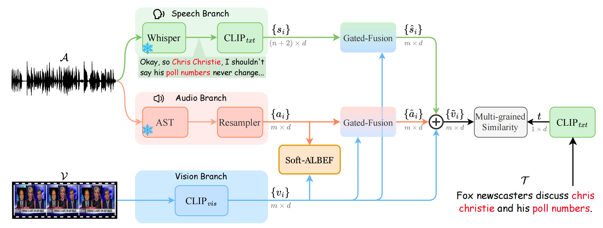

# SAVE: Speech-Aware Video Representation Learning for Video-Text Retrieval

The official source code of our CVPR 2026 paper, "[SAVE: Speech-Aware Video Representation Learning for Video-Text Retrieval](https://arxiv.org/abs/2603.08224)".



---

## Environment

We used Anaconda to setup a deep learning workspace that supports PyTorch. Run the following script to install all the required packages.

```shell
conda create -n SAVE python==3.9 -y
conda activate SAVE
git clone https://github.com/ruc-aimc-lab/SAVE.git
cd SAVE
pip install -r requirements.txt
```

---

## Data and Weights

### Pre-trained models

Three pre-trained checkpoints are required. Place them under `./pretrained/` at the repository root, with the following layout:

| Model                | Source                                                  | Path                                |
| -------------------- | ------------------------------------------------------- | ------------------------------------------- |
| CLIP ViT-B/32        | [OpenAI](https://openaipublic.azureedge.net/clip/models)   | `pretrained/CLIP/ViT-B-32.pt`             |
| AST (AudioSet 10/10) | [AST repository](https://github.com/YuanGongND/ast)        | `pretrained/AST/audioset_10_10.pth`       |
| ImageBind huge       | [ImageBind](https://github.com/facebookresearch/ImageBind) | `pretrained/ImageBind/imagebind_huge.pth` |

For convenience, we provide a script that downloads all three checkpoints and places them at the paths above:

```shell
bash preprocess/download_pretrained.sh
```

If you prefer a different location, override the path via environment variable, e.g. `export AST_PATH=/somewhere/else/audioset_10_10.pth`.

### Data download

Use **MSR-VTT** as the running example below; the same recipe applies to VATEX, Charades, and LSMDC by replacing `msrvtt` with the corresponding name.

+ **Annotations & ASR.** We provide caption annotations, data splits, and extracted ASR transcriptions at [Google Drive](https://drive.google.com/drive/folders/18Y0qnpsVNxCWPR-ePzqTG4uW3s4Xkvsn?usp=sharing). Download the folder and place its contents under `./data/`. The layout on Google Drive already matches what our code expects, so no renaming is needed.

+ **Raw videos.** Follow the guide from [CLIP4Clip: Data Preparing](https://github.com/ArrowLuo/CLIP4Clip?tab=readme-ov-file#data-preparing) to obtain the raw `.mp4` clips, and put (or symlink) them into `data/msrvtt/VideoData/`.

+ **Audio.** Extract 16 kHz mono `.wav` from each clip:
  ```shell
  python preprocess/extract_audio.py
  ```
  This populates `data/msrvtt/AudioData/`. Clips with no audio track are skipped; the dataloader substitutes `silent_file.wav` at training time.

+ **Teacher features (ImageBind).** Clone [ImageBind](https://github.com/facebookresearch/ImageBind) locally, then extract per-clip teacher features:
  ```shell
  IMAGEBIND_DIR=/path/to/ImageBind bash fe.sh
  ```
  This populates `data/msrvtt/FeatureData/ImageBind/{Audio,Video}Feature/`.

### Data organization

Before starting to run the code, please organize the data and weights in the following format (taking MSR-VTT as the example):

```shell
SAVE
├── pretrained
│   ├── CLIP
│   │   └── ViT-B-32.pt
│   ├── AST
│   │   └── audioset_10_10.pth
│   └── ImageBind
│       └── imagebind_huge.pth
└── data
    └── msrvtt
        ├── Annotations
        │   ├── MSRVTT_data.json
        │   ├── MSRVTT_train.9k.csv
        │   ├── MSRVTT_train.7k.csv
        │   ├── MSRVTT_JSFUSION_test.csv
        │   └── ...
        ├── VideoData
        │   ├── video0.mp4
        │   └── ...
        ├── AudioData
        │   ├── video0.wav
        │   └── ...
        ├── FeatureData
        │   └── ImageBind
        │       ├── AudioFeature
        │       │   ├── video0.pt
        │       │   └── ...
        │       └── VideoFeature
        │           ├── video0.pt
        │           └── ...
        └── msrvtt10k_asr_text.json
```

After everything is in place, run a one-shot sanity check:

```shell
python preprocess/verify_data.py
```

---

## Code

### Training

You can train SAVE on specific dataset splits using the following commands:

```shell
# MSR-VTT 9k
bash scripts/run_msrvtt-9k.sh

# MSR-VTT 7k
bash scripts/run_msrvtt-7k.sh
```

By default the script trains on 2 GPUs with global batch size 128. Override via env vars when needed, e.g. `NPROC=4 BATCH_SIZE=128 bash scripts/run_msrvtt-9k.sh`.

### Evaluation

After training, evaluate the models using:

```shell
INIT_MODEL=./outputs/save_msrvtt9k/pytorch_model.bin.4 bash scripts/run_eval.sh
```

---

## Citation

If you find SAVE useful in your work, please cite:

```python
@inproceedings{save,
    title={SAVE: Speech-Aware Video Representation Learning for Video-Text Retrieval},
    author={Zhao, Ruixiang and Xu, Zhihao and Lan, Bangxiang and Xin, Zijie and Liu, Jingyu and Li, Xirong},
    booktitle={CVPR},
    year={2026}
}
```

---

## Acknowledgments

Our codebase builds on [AVIGATE](https://github.com/boseung/AVIGATE), [CLIP4Clip](https://github.com/ArrowLuo/CLIP4Clip), [AST](https://github.com/YuanGongND/ast), and [ImageBind](https://github.com/facebookresearch/ImageBind). We thank the original authors for their open-sourcing.

---

## Contact

If you encounter any issue when running the code, please feel free to reach us either by creating a new issue in the GitHub or by emailing

- Zhihao Xu ([xuzhihao@ruc.edu.cn](mailto:xuzhihao@ruc.edu.cn))
- Ruixiang Zhao ([ruixiangzhao@ruc.edu.cn](mailto:ruixiangzhao@ruc.edu.cn))
